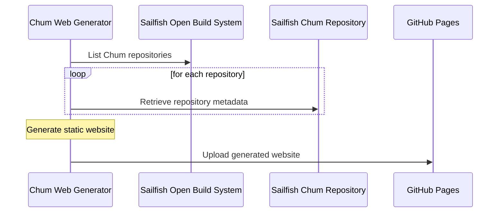

# Architecture overview
This document aims to give a simple overview of how this project is structured.

## Interaction with other systems
The following figure illustrates which other services this project talks to.

## Files

### Python code
#### [chumweb/\_\_main\_\_.py](chumweb/__main__.py)
Contains the main function.

#### [chumweb/config.py](chumweb/config.py)
Contains the definitions of all settings that can be set via environment variables
or command line options.

#### [chumweb/package.py](chumweb/package.py)
Contains dataclasses that define the structure of the metadata for a package. 
It also parses a single package.

#### [chumweb/progress.py](chumweb/progress.py)
Prints progress in the standard output

#### [chumweb/remote_image.py](chumweb/remote_image.py)
Planned utility that can download images from the internet to the local disk

#### [chumweb/repo_loader.py](chumweb/repo_loader.py)
Contains code for talking to OBS and dealing with the repository information

#### [chumweb/static_site_gen.py](chumweb/static_site_gen.py)
Generates the webpages using Jinja2 templates

#### [chumweb/statistics.py](chumweb/statistics.py)
Writes some statistics about apps to a Markdown file

### Static website data (JavaScript/CSS/images)

#### [chumweb/www/static/fallback-image.js](chumweb/www/static/fallback-image.js)
Script for displaying a fallback image if loading an image in a `` tag fails for some reason

#### [chumweb/www/static/lun.min.js](chumweb/www/static/lunr.min.js)
Copy of [Lunr.js](https://lunrjs.com/), a JavaScript library for full-text search.
Used for the search functionality.

#### [chumweb/www/static/search.js](chumweb/www/static/search.js)
Extra JavaScript used for displaying search results on the search page

#### [chumweb/www/static/style.css](chumweb/www/static/style.css)
Main style sheet

#### [chumweb/www/static/user-preferences.js](chumweb/www/static/user-preferences.js)
Over-engineered script to save user preferences in JavaScript.
Depending on the preferences, style classes are added and removed, and objects are shown/hidden.

Really only used for the architecture selection on a package page.

### Jinja2 Templates
#### [chumweb/www/views/layouts/base.html](chumweb/www/views/layouts/base.html)
The page skeleton template

#### [chumweb/www/views/layouts/meta.html](chumweb/www/views/layouts/meta.html)
Functions for adding meta tags to pages

#### [chumweb/www/views/pages/about.html](chumweb/www/views/pages/about.html)
The about page

#### [chumweb/www/views/pages/about-generator.html](chumweb/www/views/pages/about-generator.html)
A link to this page is present in the User-Agent, 
so that site administrators know who on earth is visiting them and why.

#### [chumweb/www/views/pages/index.html](chumweb/www/views/pages/index.html)
The home page with featured apps

#### [chumweb/www/views/pages/package.html](chumweb/www/views/pages/package.html)
Template page for details of a single application/package

#### [chumweb/www/views/pages/package-index.html](chumweb/www/views/pages/package-index.html)
Template page for lists of packages of any kind

#### [chumweb/www/views/pages/search.html](chumweb/www/views/pages/search.html)
Page displaying search results

#### [chumweb/www/views/parts/package-item.html](chumweb/www/views/parts/package-item.html)
File with macros to display a single list item of a package
